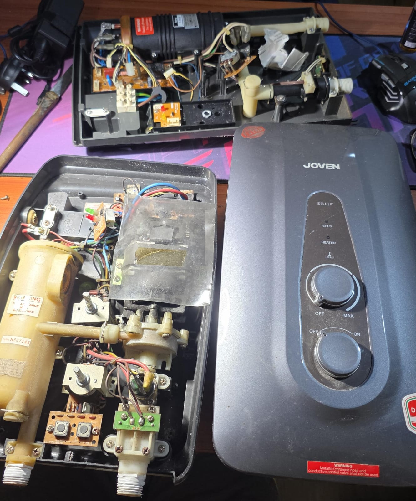
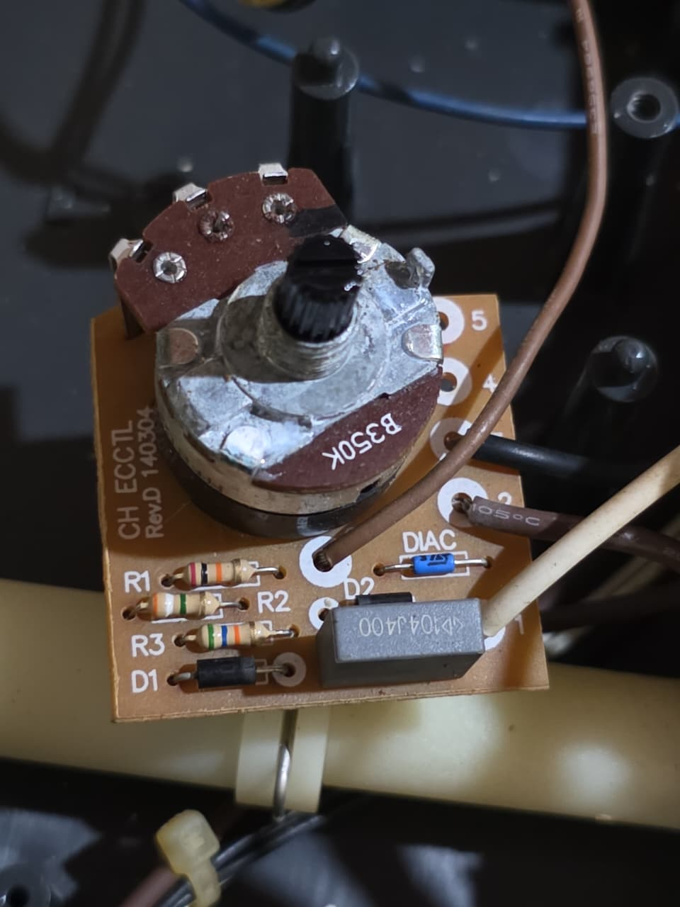
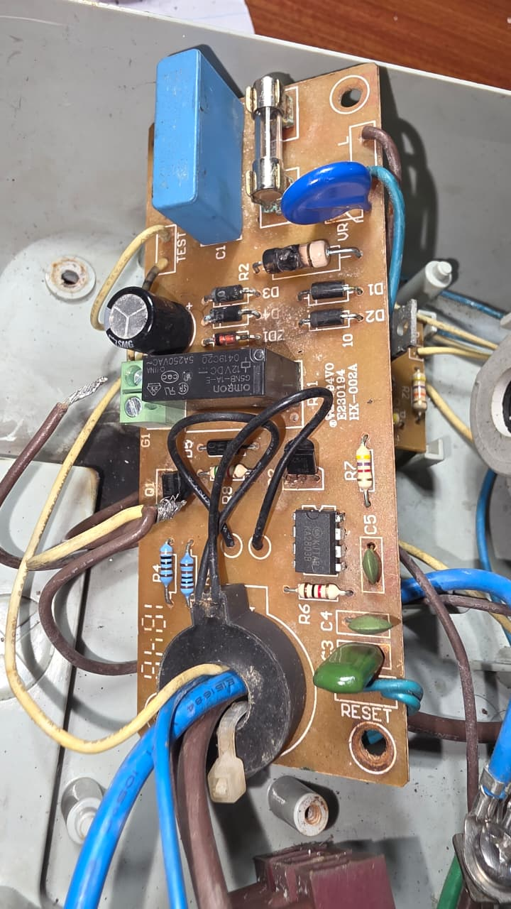
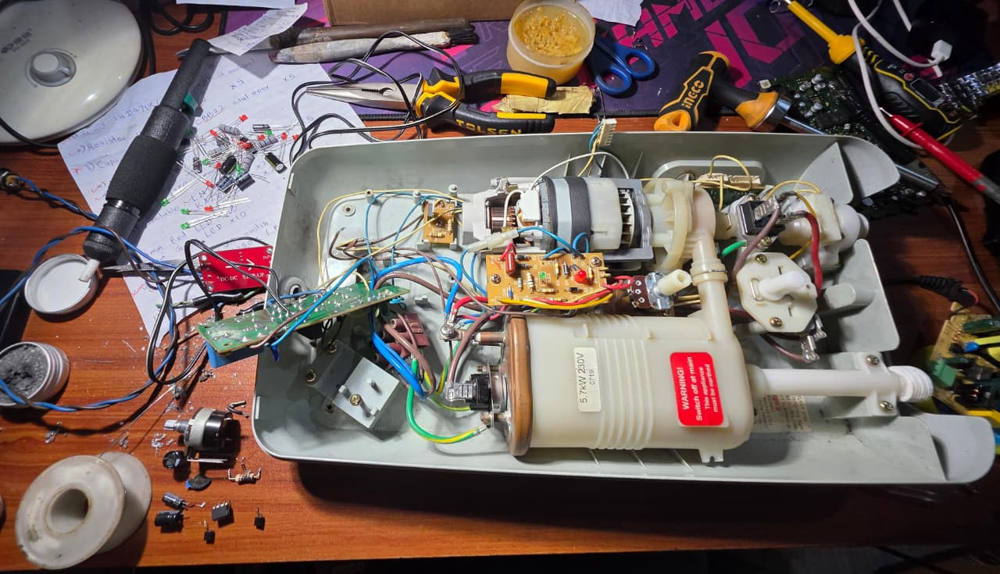
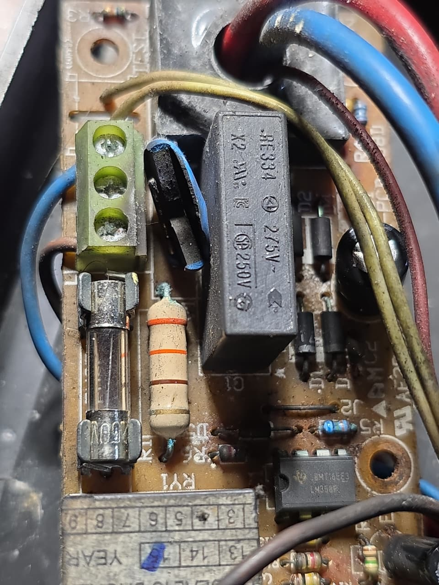

# electronics-repair-and-troubleshooting
Practical troubleshooting and repair of electronic systems

# 🔧 Electric Water Heater Repair Case Study

---

## Case 1 – Faulty Power Switch

**Device:**  
Electric Instant Water Heater  

**Problem / Symptoms:**  
- Heater not turning on reliably  
- Switch ON state shows resistance  

**Root Cause:**  
- Worn/oxidized internal switch contacts causing high resistance  

**Diagnosis Method:**  
- Multimeter (Ohmmeter)  
- Observed non-zero resistance in ON state  

**Solution:**  
- Replaced ON/OFF switch  

**Result:**  
- Heater operates normally  

**Key Learning:**  
- Contact resistance matters, not just continuity  

---

## Case 2 – Control Circuit Failure (PCB Damage + IC Fault)

**Device:**  
Electric Instant Water Heater (KA2803B based control)

**Problem / Symptoms:**  
- Heater malfunction  
- Potentiometer not working  
- Short on supply line  
- Burnt PCB track  

**Root Cause:**  
- PCB design flaw → control line too close to 230V  
- Caused short and cascading failures:
  - IC damage
  - Zener failure
  - Capacitor failure
  - Resistor burnout  

**Diagnosis Method:**  
- Visual inspection  
- Multimeter tests  
- Voltage injection (12V)  
- Thermal observation  

**Solution:**  
- Replaced:
  - KA2803B IC  
  - Zener diode  
  - Capacitor  
  - 100Ω resistor → upgraded to 2W  
- Repaired PCB with jumper wire  

**Result:**  
- Fully restored functionality  
- Stable operation  

**Key Learning:**  
- PCB clearance is critical in mixed-voltage designs  
- Carbonized PCB creates hidden shorts  

---

## Case 3 – Surge Damage + Snubber Failure

**Device:**  
Electric Instant Water Heater (with pump)

**Problem / Symptoms:**  
- Heater not working  
- MOV exploded  
- Capacitor values degraded  

**Root Cause:**  
- Surge event (likely lightning)  
- Snubber capacitor degradation increased stress  

**Diagnosis Method:**  
- Visual inspection  
- Capacitance measurement  
- Functional testing with voltage injection  

**Solution:**  
- Replaced:
  - MOV  
  - Snubber capacitors (103J → upgraded to 400V)  
  - Electrolytic capacitors  

**Result:**  
- Stable operation restored  

**Key Learning:**  
- MOV failure often indicates deeper issues  
- Preventive capacitor replacement improves reliability  

---

## 🧠 Key Engineering Takeaways

- Failures are often **cascading**
- Always verify **power supply rails first**
- Use **controlled voltage injection for safe debugging**
- Component upgrades improve durability
